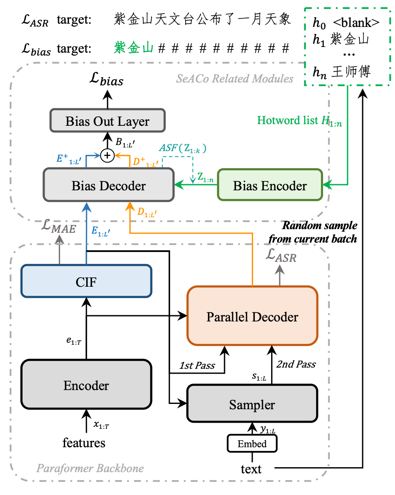
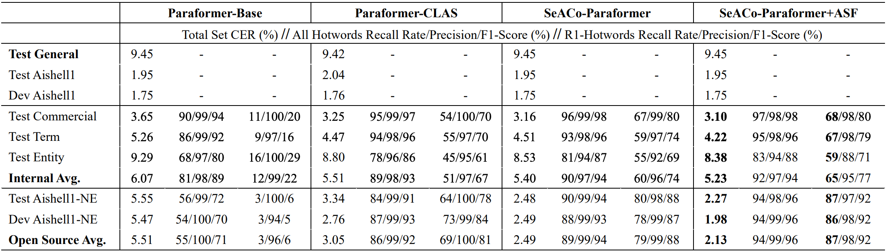

---
tasks:
- auto-speech-recognition
domain:
- audio
model-type:
- Non-autoregressive
frameworks:
- pytorch
backbone:
- transformer/conformer
metrics:
- CER
license: Apache License 2.0
language: 
- cn
tags:
- FunASR
- Paraformer
- Alibaba
- ICASSP2024
- Hotword
datasets:
  train:
  - 50,000 hour industrial Mandarin task
  test:
  - AISHELL-1-hotword dev/test
indexing:
   results:
   - task:
       name: Automatic Speech Recognition
     dataset:
       name: 50,000 hour industrial Mandarin task
       type: audio    # optional
       args: 16k sampling rate, 8404 characters  # optional
     metrics:
       - type: CER
         value: 8.53%  # float
         description: greedy search, withou lm, avg.
         args: default
       - type: RTF
         value: 0.0251  # float
         description: GPU inference on V100
         args: batch_size=1
widgets:
  - task: auto-speech-recognition
    inputs:
      - type: audio
        name: input
        title: 音频
    parameters:
      - name: hotword
        title: 热词
        type: string
    examples:
      - name: 1
        title: 示例1
        inputs:
          - name: input
            data: git://example/asr_example.wav
        parameters:
          - name: hotword
            value: 魔搭
    model_revision: v2.0.4
    inferencespec:
      cpu: 8 #CPU数量
      memory: 4096
---

# Paraformer-large模型介绍

## Highlights
Paraformer-large热词版模型支持热词定制功能：实现热词定制化功能，基于提供的热词列表进行激励增强，提升热词的召回率和准确率。


## <strong>[FunASR开源项目介绍](https://github.com/alibaba-damo-academy/FunASR)</strong>
<strong>[FunASR](https://github.com/alibaba-damo-academy/FunASR)</strong>希望在语音识别的学术研究和工业应用之间架起一座桥梁。通过发布工业级语音识别模型的训练和微调，研究人员和开发人员可以更方便地进行语音识别模型的研究和生产，并推动语音识别生态的发展。让语音识别更有趣！

[**github仓库**](https://github.com/alibaba-damo-academy/FunASR) 
|  [**最新动态**](https://github.com/alibaba-damo-academy/FunASR#whats-new) 
| [**环境安装**](https://github.com/alibaba-damo-academy/FunASR#installation)
| [**服务部署**](https://www.funasr.com)
| [**模型库**](https://github.com/alibaba-damo-academy/FunASR/tree/main/model_zoo)
| [**联系我们**](https://github.com/alibaba-damo-academy/FunASR#contact)


## 模型原理介绍

SeACoParaformer是阿里巴巴语音实验室提出的新一代热词定制化非自回归语音识别模型。相比于上一代基于CLAS的热词定制化方案，SeACoParaformer解耦了热词模块与ASR模型，通过后验概率融合的方式进行热词激励，使激励过程可见可控，并且热词召回率显著提升。

<p align="center">



SeACoParaformer的模型结构与训练流程如上图所示，通过引入bias encoder进行热词embedding提取，bias decoder进行注意力建模，SeACoParaformer能够捕捉到Predictor输出和Decoder输出的信息与热词的相关性，并且预测与ASR结果同步的热词输出。通过后验概率的融合，实现热词激励。与ContextualParaformer相比，SeACoParaformer有明显的效果提升，如下图所示：

<p align="center">


更详细的细节见：
- 论文： [SeACo-Paraformer: A Non-Autoregressive ASR System with Flexible and Effective Hotword Customization Ability](https://arxiv.org/abs/2308.03266)

## 复现论文中的结果
```python
from funasr import AutoModel

model = AutoModel(model="iic/speech_seaco_paraformer_large_asr_nat-zh-cn-16k-common-vocab8404-pytorch",
                  model_revision="v2.0.4",
                  # vad_model="damo/speech_fsmn_vad_zh-cn-16k-common-pytorch",
                  # vad_model_revision="v2.0.4",
                  # punc_model="damo/punc_ct-transformer_zh-cn-common-vocab272727-pytorch",
                  # punc_model_revision="v2.0.4",
                  # spk_model="damo/speech_campplus_sv_zh-cn_16k-common",
                  # spk_model_revision="v2.0.2",
                  device="cuda:0"
                  )

res = model.generate(input="YOUR_PATH/aishell1_hotword_dev.scp",
                     hotword='./data/dev/hotword.txt',
                     batch_size_s=300,
                    )
fout1 = open("dev.output", 'w')
for resi in res:
    fout1.write("{}\t{}\n".format(resi['key'], resi['text']))

res = model.generate(input="YOUR_PATH/aishell1_hotword_test.scp",
                     hotword='./data/test/hotword.txt',
                     batch_size_s=300,
                    )
fout2 = open("test.output", 'w')
for resi in res:
    fout2.write("{}\t{}\n".format(resi['key'], resi['text']))
```

## 基于ModelScope进行推理

- 推理支持音频格式如下：
  - wav文件路径，例如：data/test/audios/asr_example.wav
  - pcm文件路径，例如：data/test/audios/asr_example.pcm
  - wav文件url，例如：https://isv-data.oss-cn-hangzhou.aliyuncs.com/ics/MaaS/ASR/test_audio/asr_example_zh.wav
  - wav二进制数据，格式bytes，例如：用户直接从文件里读出bytes数据或者是麦克风录出bytes数据。
  - 已解析的audio音频，例如：audio, rate = soundfile.read("asr_example_zh.wav")，类型为numpy.ndarray或者torch.Tensor。
  - wav.scp文件，需符合如下要求：

```sh
cat wav.scp
asr_example1  data/test/audios/asr_example1.wav
asr_example2  data/test/audios/asr_example2.wav
...
```

- 若输入格式wav文件url，api调用方式可参考如下范例：

```python
from modelscope.pipelines import pipeline
from modelscope.utils.constant import Tasks

inference_pipeline = pipeline(
    task=Tasks.auto_speech_recognition,
    model='iic/speech_seaco_paraformer_large_asr_nat-zh-cn-16k-common-vocab8404-pytorch', model_revision="v2.0.4")

rec_result = inference_pipeline('https://isv-data.oss-cn-hangzhou.aliyuncs.com/ics/MaaS/ASR/test_audio/asr_example_zh.wav', hotword='达摩院 魔搭')
print(rec_result)
```

- 输入音频为pcm格式，调用api时需要传入音频采样率参数audio_fs，例如：

```python
rec_result = inference_pipeline('https://isv-data.oss-cn-hangzhou.aliyuncs.com/ics/MaaS/ASR/test_audio/asr_example_zh.pcm', fs=16000, hotword='达摩院 魔搭')
```

- 输入音频为wav格式，api调用方式可参考如下范例:

```python
rec_result = inference_pipeline('asr_example_zh.wav', hotword='达摩院 魔搭')
```

- 若输入格式为文件wav.scp(注：文件名需要以.scp结尾)，可添加 output_dir 参数将识别结果写入文件中，api调用方式可参考如下范例:

```python
inference_pipeline("wav.scp", output_dir='./output_dir', hotword='达摩院 魔搭')
```
识别结果输出路径结构如下：

```sh
tree output_dir/
output_dir/
└── 1best_recog
    ├── score
    └── text

1 directory, 3 files
```

score：识别路径得分

text：语音识别结果文件


- 若输入音频为已解析的audio音频，api调用方式可参考如下范例：

```python
import soundfile

waveform, sample_rate = soundfile.read("asr_example_zh.wav")
rec_result = inference_pipeline(waveform, hotword='达摩院 魔搭')
```

- ASR、VAD、PUNC模型自由组合

可根据使用需求对VAD和PUNC标点模型进行自由组合，使用方式如下：
```python
inference_pipeline = pipeline(
    task=Tasks.auto_speech_recognition,
    model='iic/speech_paraformer-large_asr_nat-zh-cn-16k-common-vocab8404-pytorch', model_revision="v2.0.4",
    vad_model='iic/speech_fsmn_vad_zh-cn-16k-common-pytorch', vad_model_revision="v2.0.4",
    punc_model='iic/punc_ct-transformer_zh-cn-common-vocab272727-pytorch', punc_model_revision="v2.0.3",
    # spk_model="iic/speech_campplus_sv_zh-cn_16k-common",
    # spk_model_revision="v2.0.2",
)
```
若不使用PUNC模型，可配置punc_model=None，或不传入punc_model参数，如需加入LM模型，可增加配置lm_model='iic/speech_transformer_lm_zh-cn-common-vocab8404-pytorch'，并设置lm_weight和beam_size参数。

## 基于FunASR进行推理

下面为快速上手教程，测试音频（[中文](https://isv-data.oss-cn-hangzhou.aliyuncs.com/ics/MaaS/ASR/test_audio/vad_example.wav)，[英文](https://isv-data.oss-cn-hangzhou.aliyuncs.com/ics/MaaS/ASR/test_audio/asr_example_en.wav)）

### 可执行命令行
在命令行终端执行：

```shell
funasr +model=paraformer-zh +vad_model="fsmn-vad" +punc_model="ct-punc" +input=vad_example.wav
```

注：支持单条音频文件识别，也支持文件列表，列表为kaldi风格wav.scp：`wav_id   wav_path`

### python示例
#### 非实时语音识别
```python
from funasr import AutoModel
# paraformer-zh is a multi-functional asr model
# use vad, punc, spk or not as you need
model = AutoModel(model="paraformer-zh", model_revision="v2.0.4",
                  vad_model="fsmn-vad", vad_model_revision="v2.0.4",
                  punc_model="ct-punc-c", punc_model_revision="v2.0.4",
                  # spk_model="cam++", spk_model_revision="v2.0.2",
                  )
res = model.generate(input=f"{model.model_path}/example/asr_example.wav", 
            batch_size_s=300, 
            hotword='魔搭')
print(res)
```
注：`model_hub`：表示模型仓库，`ms`为选择modelscope下载，`hf`为选择huggingface下载。

#### 实时语音识别

```python
from funasr import AutoModel

chunk_size = [0, 10, 5] #[0, 10, 5] 600ms, [0, 8, 4] 480ms
encoder_chunk_look_back = 4 #number of chunks to lookback for encoder self-attention
decoder_chunk_look_back = 1 #number of encoder chunks to lookback for decoder cross-attention

model = AutoModel(model="paraformer-zh-streaming", model_revision="v2.0.4")

import soundfile
import os

wav_file = os.path.join(model.model_path, "example/asr_example.wav")
speech, sample_rate = soundfile.read(wav_file)
chunk_stride = chunk_size[1] * 960 # 600ms

cache = {}
total_chunk_num = int(len((speech)-1)/chunk_stride+1)
for i in range(total_chunk_num):
    speech_chunk = speech[i*chunk_stride:(i+1)*chunk_stride]
    is_final = i == total_chunk_num - 1
    res = model.generate(input=speech_chunk, cache=cache, is_final=is_final, chunk_size=chunk_size, encoder_chunk_look_back=encoder_chunk_look_back, decoder_chunk_look_back=decoder_chunk_look_back)
    print(res)
```

注：`chunk_size`为流式延时配置，`[0,10,5]`表示上屏实时出字粒度为`10*60=600ms`，未来信息为`5*60=300ms`。每次推理输入为`600ms`（采样点数为`16000*0.6=960`），输出为对应文字，最后一个语音片段输入需要设置`is_final=True`来强制输出最后一个字。

#### 语音端点检测（非实时）
```python
from funasr import AutoModel

model = AutoModel(model="fsmn-vad", model_revision="v2.0.4")

wav_file = f"{model.model_path}/example/asr_example.wav"
res = model.generate(input=wav_file)
print(res)
```

#### 语音端点检测（实时）
```python
from funasr import AutoModel

chunk_size = 200 # ms
model = AutoModel(model="fsmn-vad", model_revision="v2.0.4")

import soundfile

wav_file = f"{model.model_path}/example/vad_example.wav"
speech, sample_rate = soundfile.read(wav_file)
chunk_stride = int(chunk_size * sample_rate / 1000)

cache = {}
total_chunk_num = int(len((speech)-1)/chunk_stride+1)
for i in range(total_chunk_num):
    speech_chunk = speech[i*chunk_stride:(i+1)*chunk_stride]
    is_final = i == total_chunk_num - 1
    res = model.generate(input=speech_chunk, cache=cache, is_final=is_final, chunk_size=chunk_size)
    if len(res[0]["value"]):
        print(res)
```

#### 标点恢复
```python
from funasr import AutoModel

model = AutoModel(model="ct-punc", model_revision="v2.0.4")

res = model.generate(input="那今天的会就到这里吧 happy new year 明年见")
print(res)
```

#### 时间戳预测
```python
from funasr import AutoModel

model = AutoModel(model="fa-zh", model_revision="v2.0.4")

wav_file = f"{model.model_path}/example/asr_example.wav"
text_file = f"{model.model_path}/example/text.txt"
res = model.generate(input=(wav_file, text_file), data_type=("sound", "text"))
print(res)
```

更多详细用法（[示例](https://github.com/alibaba-damo-academy/FunASR/tree/main/examples/industrial_data_pretraining)）


## 微调

详细用法（[示例](https://github.com/alibaba-damo-academy/FunASR/tree/main/examples/industrial_data_pretraining)）


## 相关论文以及引用信息

```BibTeX
@article{shi2023seaco,
  title={SeACo-Paraformer: A Non-Autoregressive ASR System with Flexible and Effective Hotword Customization Ability},
  author={Shi, Xian and Yang, Yexin and Li, Zerui and Zhang, Shiliang},
  journal={arXiv preprint arXiv:2308.03266 (accepted by ICASSP2024)},
  year={2023}
}
```
